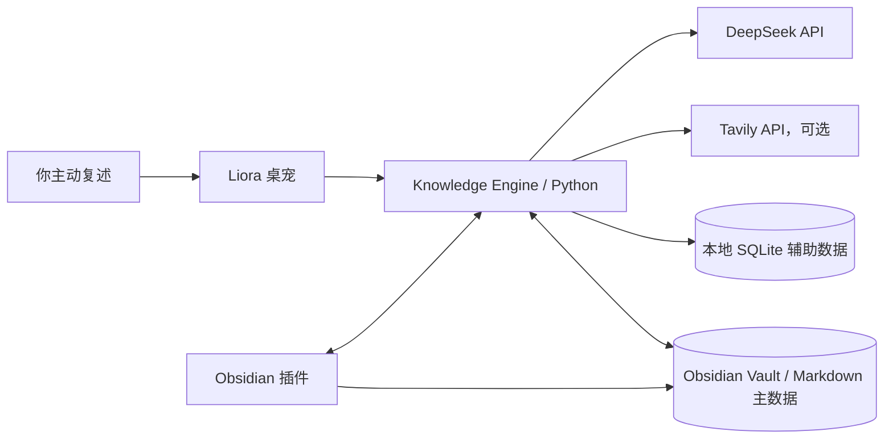
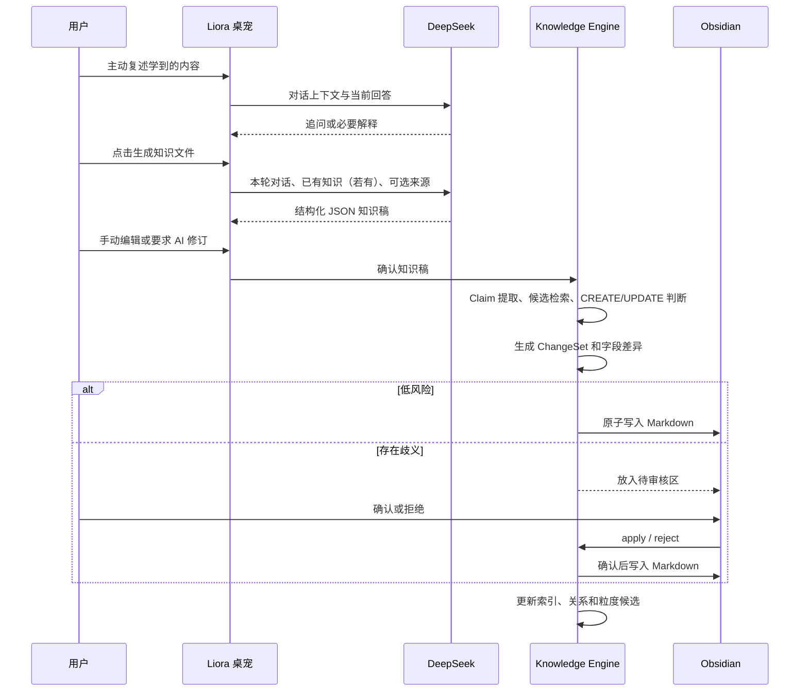

# Liora Obsidian 插件与 Knowledge Engine：现状、算法与 DeepSeek 调用说明

> 文档基准：2026-08-13，Obsidian 插件版本 `0.6.0`，Liora 桌面端版本 `0.2.4`。
> 这是一份“当前源码实现说明”，不是只描述理想目标的产品愿景。文中会明确区分：已经实现、当前只是本地启发式算法、尚未实现或建议后续升级。

> 语义核心更新：本项目现已接入本地 `bge-small-zh-v1.5` ONNX INT8 Embedding。下文中保留的“384 维哈希向量”说明仅指模型缺失或加载失败时的兼容降级路径。

> 本轮进展：Home 与知识管理台已完成一轮 Obsidian 原生化视觉重构；“最近的知识”已可直接打开对应 Markdown；新关联不再只显示分数，而会展示两侧原文证据；关系算法已排除 Liora 管理标记和通用模板标题造成的伪关联，并在每次刷新时重建未决候选。上述后端修复已经进入桌面端 `0.2.4` 安装包。

## 1. 先用一句话理解现在的系统

Liora 当前采用的是一套混合架构：

> 你向桌宠主动复述，DeepSeek 负责追问并把复述整理成结构化知识稿；本地 Knowledge Engine 负责扫描 Obsidian、判断新建还是更新、生成审核记录、发现关系、提出粒度建议和安排回顾；Obsidian Markdown 是长期知识主数据。

最重要的边界有四条：

1. Obsidian 插件不是 AI 模型，它是知识首页和管理界面。
2. Knowledge Engine 在 Liora 后端中运行，插件通过本机 API 调用它。
3. DeepSeek 目前只参与“复述对话、知识稿生成、按意见修订”，不负责所有后台维护算法。
4. Vault 中的 Markdown 不再经过“是不是 Knowledge Object”的准入判断：只要你放进这个专用 Vault，它就属于知识库。

## 2. 当前系统架构



各组件的真实职责如下：

| 组件 | 当前职责 | 不负责什么 |
| --- | --- | --- |
| Liora 桌宠 | 复述入口、对话、知识稿确认、独立“回顾”气泡、启动后端 | 不直接扫描或重构 Vault |
| Obsidian 插件 | 自定义 Home、管理台、差异审核、关系与粒度候选展示、跨知识提问入口 | 不直接调用 DeepSeek，不在插件进程里运行主要算法 |
| Knowledge Engine | Vault 索引、对齐、ChangeSet、关系、检索、粒度、认知调度、本机 API | 当前不是持续自治的 LLM Agent |
| Obsidian Vault | 长期知识正文和可迁移的主数据 | 不保存原始复述对话 |
| SQLite | 索引、向量、状态、审核和回滚辅助数据 | 连接 Vault 后不是知识正文的最终主数据 |
| DeepSeek | 追问、知识稿生成、按意见修订 | 当前不参与 D/E/F/G 的日常算法判断 |
| Tavily | 必要时联网查证并提供来源摘要 | 不整理知识，也不是 DeepSeek 的替代品 |

## 3. 插件是否属于 Liora，以及安装包会不会变大

插件源码确实放在 Liora 仓库的 `obsidian-plugin/` 目录中，方便共同开发和版本管理；但它是一个独立的 Node/TypeScript 工程。

当前 Electron 打包配置只把 `src/`、`assets/`、桌宠运行所需 Python Runtime 和本地语音模型放入 Liora 安装包，并没有把整个 `obsidian-plugin/` 源码目录打进 Electron 应用。因此：

- 放在同一个 Git 仓库，不等于放进同一个安装包；
- 插件最终安装到 Vault 的 `.obsidian/plugins/liora-knowledge/`；
- 插件自身主要是编译后的 JavaScript、manifest 和 CSS，体积远小于 Python Runtime 或语音模型；
- Liora 安装包体积的主要来源仍是 Electron、Python Runtime 和语音模型，不是 Obsidian 插件。

当前已重新发布桌面端 `0.2.4`：安装包包含本轮 Knowledge Engine 关系降噪修复、本地 Python Runtime 与 `bge-small-zh-v1.5` 模型；Obsidian 插件仍需独立部署到 Vault，不会随桌面安装包自动安装。`release/` 当前只保留 `Liora-Setup-0.2.4-x64.exe` 及其 blockmap、`latest.yml` 和 SHA-256 校验文件。

Codex 只是开发这个插件时使用的编程工具，不是运行时依赖。使用插件不需要把 Codex 接入 Obsidian。

## 4. 插件究竟怎样“改变 Obsidian 首页”

当前实现没有修改 Obsidian 核心代码，也不会重写默认的新标签页。它注册了两个自定义 `ItemView`：

- `liora-knowledge-home`：Liora Home；
- `liora-knowledge-manager`：Liora 管理台。

点击左侧房子图标或执行命令“打开 Liora Home”后，插件在 Obsidian 工作区打开这个自定义视图。Obsidian 会保存工作区布局，所以你把它固定在主区域后，它在使用体验上就像知识库主页。

因此，“自定义主页”的准确含义是：

> 插件提供一个可以长期固定的 Obsidian 工作区视图，而不是覆盖 Obsidian 内置首页。

如果以后需要“每次打开 Vault 都自动显示 Liora Home”，可以再增加启动时自动激活视图的设置；当前主要通过图标和命令打开。

## 5. 从复述到知识库的完整数据流



确认后的长期结果是知识文件，不是聊天记录。一次会话在活跃期间会暂存在 SQLite；知识确认完成或会话被丢弃后，消息和草稿会被删除，只保留会话摘要、学习状态，以及必要的 ChangeSet 回滚数据。

## 6. Vault 中什么算知识

### 6.1 当前准入规则

在已连接的专用 Vault 中，所有 Markdown 文件都被视为知识。系统不会再问“它是不是 Knowledge Object”。

扫描时只忽略以下目录中的 Markdown：

- `.git`
- `.obsidian`
- `.trash`
- `node_modules`
- `templates`

这与现在的产品判断一致：你既然主动把文件放进这个 Vault，就已经完成了知识准入决定；AI 的责任是维护、对齐和找关系，不是再次审批它能否成为知识。

### 6.2 “Knowledge Object”现在代表什么

它不再是准入门槛，而是 Knowledge Engine 对一份 Markdown 的内部结构化视图。解析器会尽量得到：

```json
{
  "title": "标题",
  "core_insight": "核心理解",
  "key_points": [],
  "logic_chain": [],
  "examples": [],
  "extensions": [],
  "boundaries": [],
  "connections": [],
  "open_questions": [],
  "next_step": "",
  "sources": []
}
```

普通 Markdown 即使没有这些标准标题，也仍然会被索引；能够解析出的正文进入相应字段，缺少的字段为空。`type` 或 `source` frontmatter 只描述文件类型和来源，不决定它是否被知识管理系统接纳。

### 6.3 文件 ID 与重命名

- Liora 新建的文件会写入稳定 UUID；
- 普通 Markdown 没有 ID 时，首次扫描会生成本地 ID；
- 文件重命名但内容哈希不变时，索引会尽量沿用旧 ID；
- 如果发生重复 ID，会根据路径生成冲突回退 ID。

## 7. Markdown 的写入策略

### 7.1 Liora 新建文件

默认写入：

```text
00 Inbox/Liora/标题--ID前8位.md
```

文件包含 frontmatter、标题和一个受管理区块：

```markdown
---
id: "..."
type: knowledge
title: "..."
version: 1
source: liora
schema_version: 1
---

# 标题

<!-- liora:begin -->
...Liora 整理的结构化内容...
<!-- liora:end -->
```

### 7.2 更新你原来写的普通 Markdown

如果目标文件不是 Liora 创建的，系统不会把整篇原文替换成统一模板，而是：

1. 保留原文；
2. 增加或更新 `liora_id`、`liora_version`、`liora_updated`；
3. 在文件中追加或替换 `<!-- liora:begin -->` 到 `<!-- liora:end -->` 的受管理区块。

这样可以保护手写内容，但也意味着同一个文件可能同时包含你的原文和 Liora 的结构化整理区。它不是原始对话的重复副本，但有时会出现概念内容重复；这是当前“保护用户原文优先”策略的取舍。

### 7.3 写入安全

所有 Markdown 写入使用同目录临时文件、刷新到磁盘后再 `os.replace`，尽量避免程序中断时留下半个文件。路径也会校验必须位于所选 Vault 内。

## 8. Obsidian 插件已有功能

### 8.1 Liora Home

首页当前显示：

- 与 Home 统一的顶部品牌区、Knowledge Engine 在线/离线状态和常用功能入口；
- 顶部横幅，以及左侧主内容、右侧日期工作栏组成的无横向滚动布局；
- 从知识“尚待探索 / open_questions”中选出的回顾问题，并可换一个、暂缓三天、查看原因或打开原知识；
- “问问我的知识库”入口，与回顾内容组成同一个对话板块；
- 周历、按日期保存的简单备忘纸条，以及完成、删除操作；
- 最近更新的知识列表；列表采用无外框的编辑式排版，点击后会在 Obsidian 新标签页打开真实 Markdown；
- Vault 中的知识总数与认知状态仍由 Dashboard 数据提供，但页面会根据窗格高度和宽度收敛信息密度，避免横向滚动，并尽量维持单屏工作台。

### 8.2 Liora 管理台

管理台当前包含：

- 与 Home 对齐的品牌区、字体、宽度和横幅视觉；横幅只截取图片中部并横跨工作区；
- 左侧紧凑纵向导航：待你确认、新关联、知识结构、照料记录；
- 中栏按当前标签展示内容卡片，卡片横向占满并向下排列；只有中栏独立滚动，左右栏保持固定；
- 右栏是放大的“问问整个知识库”对话区，直接呈现在背景上，并用细线与工作区分隔；
- 待审核 ChangeSet、字段级变更前后对照，以及确认应用、拒绝和回滚；
- Hard / Soft Connection 的确认与拒绝。每条新关联会同时展示两份知识的标题、可核对原文片段、关系依据和线索强度，标题可直接打开对应 Markdown；
- Split / Merge 粒度候选的应用或拒绝，以及 Parent → Child 多尺度层级列表。

### 8.3 离线行为

插件无法连接 Liora 时，会进入 `VAULT ONLY` 只读降级模式：

- 仍可直接读取 Vault 里的 Markdown 数量、最近文件和开放问题；
- 不能执行 ChangeSet、关系、粒度、回顾启动等需要 Knowledge Engine 的功能；
- 管理台会提示需要先启动 Liora。

因此插件不会因为桌宠未启动而完全空白，但“智能维护”必须由本地 Knowledge Engine 提供。

## 9. 插件与 Knowledge Engine 如何连接

Liora 启动后，会启动只监听 `127.0.0.1` 的 Python HTTP 服务，并生成随机访问令牌。Electron 把连接信息原子写入：

```text
%APPDATA%/liora-desktop-companion/knowledge-engine.json
```

文件大致包含：

```json
{
  "schema_version": 1,
  "host": "127.0.0.1",
  "port": 端口,
  "token": "随机令牌",
  "pid": 进程号,
  "updated_at": "时间"
}
```

插件优先使用设置页中手动填写的地址与令牌；没有手动配置时，就自动发现这个文件。插件只接受 `127.0.0.1` 和合法端口，所有 API 请求都必须带 `X-Liora-Token`。

这套连接机制的目的不是把服务暴露到互联网，而是让两个本机应用安全地协作。退出 Liora 时，对应连接文件会被清理。

## 10. DeepSeek API 的准确使用范围

### 10.1 当前会调用 DeepSeek 的三个环节

| 环节 | 发给 DeepSeek 的主要内容 | 返回结果 | 当前参数 | 无 DeepSeek 时 |
| --- | --- | --- | --- | --- |
| 复述追问 | 最近最多 12 条对话、当前轮次、可选联网资料 | 一次自然追问或必要解释 | `temperature=0.55`，`max_tokens=320` | 使用本地规则继续追问 |
| 生成知识稿 | 本轮完整对话、正在完善的旧知识、可选来源摘要 | 严格 JSON 知识稿 | `temperature=0.25`，`max_tokens=3200` | 使用本地规则生成较简单草稿 |
| 按意见修订 | 原始会话、当前知识稿、你的修改意见、可选来源 | 修订后的严格 JSON | `temperature=0.2`，`max_tokens=3200` | 当前无法使用 AI 修订；仍可手动改字段 |

请求发送到配置的 OpenAI 兼容接口：

```text
{DEEPSEEK_BASE_URL}/chat/completions
```

当前请求关闭模型 thinking，使用非流式返回。默认配置示例是：

```dotenv
DEEPSEEK_API_KEY=
DEEPSEEK_BASE_URL=https://api.deepseek.com
DEEPSEEK_MODEL=deepseek-v4-flash
DEEPSEEK_TIMEOUT_SECONDS=30
```

模型名是可配置项，不是算法代码中的永久固定值。

### 10.2 DeepSeek 在知识稿生成时被要求做什么

系统提示要求它：

- 把对话当作主题、关注点和认知缺口的素材；
- 生成脱离对话也能独立阅读的知识文件，而不是聊天摘要；
- 直接解释知识，不写“用户提到”“本次对话认为”；
- 必要时用可靠常识补充定义、机制、例子、边界与联系；
- 纠正明显错误，无法确认的内容放入 `open_questions`；
- 不编造来源或 URL；
- 输出固定 JSON 结构。

最终结果还会经过本地格式校验：

- `title`、`core_insight` 必须存在；
- `key_points` 和 `logic_chain` 至少有一个非空；
- 标题最多 80 字；
- 核心理解最多 3000 字；
- 各数组有 6 或 8 项上限和单项长度限制；
- 来源按 URL 去重，最多 8 条。

所以 DeepSeek 负责内容理解与表达，本地代码负责结构约束和边界校验。

### 10.3 当前明确不会调用 DeepSeek 的环节

以下功能全部在本机执行：

- 扫描和解析 Vault；
- 判断 Markdown 是否属于知识库；
- Claim Extraction；
- 生成本地 BGE 语义向量，以及模型不可用时的 384 维降级向量；
- 候选检索与 CREATE/UPDATE 判断；
- ChangeSet 和差异生成；
- 应用、拒绝和回滚；
- Hard / Soft Connection 发现；
- 当前版本的跨知识问答；
- Split / Merge 候选计算；
- Parent / Child 写入；
- 认知曲线、回顾日期和健康状态；
- 手动编辑知识稿；
- Obsidian 插件所有 UI 展示。

知识自动对齐有一个严格例外：当本地 BGE 候选处于歧义区，且 `LIORA_ALIGNMENT_JUDGE=balanced` 时，Knowledge Engine 会把新知识稿和 Top 3 候选摘要发给 DeepSeek 做一次受约束的 CREATE / UPDATE / RELATED / CHILD 裁判。它不会发送整个 Vault，结论也不能直接落盘。

尤其要注意：插件从不直接把 Vault 发给 DeepSeek。它调用的是本机 Knowledge Engine；后端只在复述生成、修订或上述歧义对齐时调用 DeepSeek。

## 11. Tavily 联网查证与 DeepSeek 的关系

Tavily 是独立的可选 API，不是 DeepSeek 的一部分。配置项为：

```dotenv
TAVILY_API_KEY=
TAVILY_BASE_URL=https://api.tavily.com
TAVILY_TIMEOUT_SECONDS=15
TAVILY_MAX_RESULTS=4
```

当文本包含联网、搜索、查证、最新、版本、政策、价格、论文、不确定等信号时，后端才可能查询 Tavily。查询结果只保留标题、URL 和最多 1200 字的摘要，再作为证据上下文交给 DeepSeek。

数据边界是：

- Tavily 接收当前搜索查询，不接收整个 Vault；
- DeepSeek 会接收本轮会话，以及 Tavily 返回的来源摘要；
- 没有 Tavily Key 时，复述仍可继续，只是不能联网核实；
- `sources` 记录的是外部证据，不是原始对话备份。

## 12. 阶段 D：知识自动对齐

阶段 D 的目标不是判断一段内容“配不配进入知识库”，而是回答：

> 这份已经确认要保存的知识稿，应当新建一份 Markdown，还是更新某份已有知识？

### 12.1 Claim Extraction 的当前实现

当前 Claim Extraction 是确定性的本地切分，不是 LLM 语义抽取：

1. 从 `core_insight` 按换行或带空白的句号、问号、感叹号边界切分；
2. 至少 8 个字符的核心段落成为 `core` claim；
3. `key_points`、`logic_chain`、`examples`、`extensions`、`boundaries`、`connections`、`open_questions` 中的每一项各自成为 claim；
4. 按小写化和空白归一后的文本去重；
5. 最多保留 48 条，每条最多 800 字。

因此它更准确的名字是“结构化字段切片器”。它便宜、可重复、完全本地，但还不能识别潜台词、错误类型或一句话中的多个复合主张。

### 12.2 当前 Embedding 是什么

默认语义层现为本地 `bge-small-zh-v1.5` ONNX INT8 模型：

- 512 维神经网络语义向量；
- 模型在本机通过 ONNX Runtime 推理；
- 不按调用计费，也不会把知识发送到 Embedding API；
- 只在知识内容指纹或模型版本变化时重算；
- 短查询会增加 BGE 官方建议的中文检索指令，知识正文不加；
- 模型不会被程序静默下载，需要显式执行 `python scripts/setup-embedding-model.py`。

如果模型不存在、ONNX Runtime 不兼容或加载失败，Knowledge Engine 会自动退回旧的本地哈希路径：

1. 对标题和所有结构化内容字段拼接；
2. 提取英文/数字词、单个汉字和紧邻字符二元组；
3. 用 `blake2b` 把每个特征哈希到 384 个维度；
4. 根据哈希位给维度加 `+1` 或 `-1`；
5. 对向量做 L2 归一化；
6. 使用余弦相似度比较。

语义模型在数据库中的名字是 `bge-small-zh-v1.5-onnx-int8`；降级模型名是 `liora-local-ngram-v1`。内容指纹使用 SHA-256，缓存同时校验内容指纹与模型名，避免把两种不同维度的向量混用。

BGE 比字符哈希更能理解中文同义改写和主题关系，但它仍不是事实裁判。界面里的相似度百分比不是统计概率，也不是经过个人评测集校准的“置信度”。

### 12.3 候选检索

新草稿被向量化后，与最多 1000 份已索引知识逐一计算余弦相似度：

- 只保留分数大于 0 的结果；
- 按分数从高到低排序；
- 自动对齐阶段取前 6 个候选；
- 通用检索接口最多返回 30 个候选。

### 12.4 CREATE / UPDATE 决策顺序

判断有严格优先级：

| 优先级 | 条件 | 动作 | decision basis | 标注值 |
| --- | --- | --- | --- | --- |
| 1 | 本轮明确从某知识继续完善 | UPDATE 指定知识 | `explicit` | `1.00` |
| 2 | 标题去除非单词字符后完全一致 | UPDATE 同名知识 | `exact_title` | `0.98` |
| 3 | BGE 综合分 `>= 0.62` | 建议 UPDATE 第一候选 | `semantic` | 使用实际综合分 |
| 4 | BGE 综合分 `>= 0.30` 且 `< 0.62` | 建议 CREATE，但标记有关联 | `novel` | `1 - score × 0.45` |
| 5 | 没有足够相似候选 | CREATE | `novel` | `0.72` |

### 12.5 哪些对齐会进入待审核区

不是所有 ChangeSet 都要你审核。当前风险规则是：

- 明确继续完善某知识：低风险，自动应用；
- 标题完全一致：低风险，自动应用；
- 没有相似候选的新知识：低风险，自动创建；
- 仅靠 BGE 综合分判断应该更新：需要审核；
- BGE 综合分落在相关区间，但仍建议创建新对象：需要审核。

综合分使用 `0.88 × BGE cosine + 0.12 × lexical overlap` 做轻量精排。`0.30 / 0.62` 是初始保守阈值，仍需要用真实 Vault 评测集继续校准；BGE 官方也明确提示相似度绝对值应按具体数据分布选阈值。

### 12.6 DeepSeek 歧义裁判

默认 `LIORA_ALIGNMENT_JUDGE=balanced` 时，只有本地候选进入歧义区才额外调用一次 DeepSeek。发送范围仅为：新知识稿、Top 3 候选的标题/摘要/关键点，以及本地分数，不发送整个 Vault。

DeepSeek 必须返回 `CREATE / UPDATE / RELATED / CHILD` 之一，UPDATE、RELATED、CHILD 的目标 ID 必须属于 Top 3；否则结果作废并保留本地判断。模型结果始终进入待审核 ChangeSet，不能绕过人工确认。相同草稿、候选版本和模型组合会缓存，不重复计费。

此外可用 `LIORA_ALIGNMENT_DAILY_LIMIT` 设置每日最多产生多少次新的歧义裁判缓存，默认 20 次。达到上限后继续使用本地候选并等待人工审核，不会为了“完成流程”继续付费调用。

这里的待审核区是“歧义缓冲区”：避免一个启发式相似度阈值擅自覆盖旧知识，或在边界模糊时制造重复对象。

### 12.7 更新已有知识时如何合并

当前合并策略是：

- 新草稿的 `title`、`core_insight`、`next_step` 等标量字段覆盖旧值；
- 八个列表字段把旧项放前、新项放后，按不区分大小写的字符串去重；
- 每个列表最多保留 8 项。

这是一套可预测的本地合并，不是 DeepSeek 重新通读新旧知识后做语义融合。因此两个表述不同但意思相同的要点仍可能并存，超出 8 项的后续内容也可能被截断。

## 13. 阶段 E：知识变更审核

### 13.1 待审核区到底是干什么的

待审核区不是“判断这是不是知识”，也不是“存放还没整理好的对话”。它只负责审查可能写错目标的文件变更：

> Liora 已经生成了一份知识稿，但本地算法不能完全确定它应该新建还是覆盖某份旧知识，所以先展示变更计划，等你做最后决定。

如果没有这个缓冲区，一次错误相似度判断可能直接改坏一份原有 Markdown。

### 13.2 ChangeSet 保存什么

每次确认知识稿都会先生成一个 ChangeSet，主要字段包括：

- `action`：`create` 或 `update`；
- `target_id`、`target_path`：目标知识和文件；
- `risk`：`low` 或 `review`；
- `reason`：为什么新建或更新；
- `alignment`：claims、候选、分数、决策依据；
- `before`：原结构化内容；
- `after`：拟写入的结构化内容；
- `diff`：字段级差异；
- `before_markdown`：更新前的完整 Markdown，用于精确回滚；
- `result`：应用后的知识信息；
- 创建、处理、应用和回滚时间。

状态流转是：

```text
pending ──apply──> applied ──rollback──> rolled_back
   └────reject──> rejected
```

### 13.3 Obsidian 中的差异是什么

目前是插件自己渲染的字段级 before / after 对照，不是 Obsidian Git 插件的行级 diff，也不会在编辑器里使用修订模式。它适合看“核心理解、关键要点、联系”等字段发生了什么变化，但不显示精确到字符的增删标记。

### 13.4 确认、拒绝和回滚

- 确认：Knowledge Engine 原子写入 Markdown，ChangeSet 变为 `applied`；
- 拒绝：不写 Vault，ChangeSet 变为 `rejected`；
- 回滚 UPDATE：把 `before_markdown` 原样写回；
- 回滚 CREATE：删除该 ChangeSet 创建的新文件；
- 完成后重新索引并刷新关系、向量和粒度候选。

### 13.5 它会不会占很多空间

待审核区不保存原始聊天，但 UPDATE ChangeSet 会保存一份修改前的完整 Markdown，以支持真正回滚。所有低风险且已应用的 ChangeSet 目前也会留在 SQLite 中。

这意味着：

- 它比保存每次原始对话更克制；
- 但长期使用后，历史 `before_markdown` 仍会增长；
- 当前没有自动清理或保留期限策略；
- 后续可以增加“只保留最近 N 次 / N 天回滚点”或压缩旧版本。

## 14. 阶段 F：检索与关系

### 14.1 语义检索

当前检索使用第 12.2 节描述的本地 BGE 向量：

```text
查询文本 → 512 维 BGE 向量 → 与所有知识算余弦相似度 → 词法轻量精排 → 排序
```

优点是离线、零 API 成本、可随时重建，而且 BGE 已经是真正的神经语义 Embedding；当前局限主要在于全量逐项比较、阈值仍是原型经验值，以及尚未用个人知识库数据进行校准。只有模型缺失或加载失败时，才会降级为更接近字符与词特征的 384 维哈希向量。

### 14.2 Hard Connection

如果知识正文中出现目标标题的 Obsidian WikiLink，或 `connections` 字段明确包含目标标题，就创建：

- `kind = hard`
- `label = explicit_reference`
- `confidence = 1.0`
- `status = confirmed`

WikiLink 是最可靠的显式关系。单纯标题子串命中 `connections` 也会被视为 Hard Connection，标题过短或含义模糊时可能误判。

### 14.3 Soft Connection

没有显式连接的两份知识会比较本地向量。关系发现前会先构造专用的“关系正文”：只读取 `core_insight`、`key_points`、`logic_chain`、`examples`、`extensions`、`boundaries` 和 `connections`，并清理以下噪声：

- 正确的 `<!-- liora:begin -->` / `<!-- liora:end -->` 标记；
- 历史拼写或格式错误的 `loria`、`<!loria-begin->` 等兼容标记；
- Markdown 标题符号、`Liora 整理：` 前缀；
- “核心理解”“关键要点”“尚待探索”“暂无”“待补充”等通用模板行。

当前 Soft Connection 必须同时满足：

```text
0.36 <= BGE cosine similarity < 0.82
两侧正文都具有足够的实质性 token
且至少存在正文词法交集、正文标题指向，或较强的纯语义证据
```

满足条件后才生成 Soft Connection 候选，等待你确认或拒绝。标题相似、管理标记一致或模板结构相同本身都不再构成关系证据。

Soft Connection 只是候选，不等于事实。高于上限的对象交由重复知识和 Merge 候选处理。

管理台不再只展示一个相似度百分比。插件会读取候选两侧的 Markdown，抽取最相关的原文片段并并排呈现，标明“正文明确指向”或“语义相近”；两侧标题都可直接打开原文件。若文件已移动且无法解析路径，则明确提示无法读取原文，不伪造证据。

关系刷新采用“重建未决候选”的策略：每次发现关系前先删除 `status = candidate` 的派生行，再写入当前算法仍认可的候选，因此旧版算法留下的模板伪关联会自然消失；用户已经确认或拒绝的关系状态会保留，不会被刷新覆盖。语义指纹已升级为 `semantic-clean-v2`，会令旧清洗规则生成的缓存向量失效并按新正文重算。

### 14.4 跨知识提问

当前“问问整个知识库”的真实流程是：

1. 用 BGE 问题向量检索前 5 个候选；
2. 取前 3 个有 `core_insight` 的知识作为证据；
3. 如果综合分 `< 0.28`，返回没有足够依据；
4. 否则按知识标题拼接核心理解，并给出可点击证据和分数。

它不会调用 DeepSeek，也不会做多文档推理、冲突消解或重新组织答案。更准确地说，这是“带证据的本地检索回答 v1”，还不是生成式 RAG。

### 14.5 当前复杂度和规模边界

- 向量以 JSON 数组保存在 SQLite，不是专用向量数据库；
- 检索目前逐个比较，约为 `O(N)`；
- 关系发现和 Merge 候选两两比较，约为 `O(N²)`；
- 当前适合个人小型或中型 Vault；
- 当知识达到数千到数万份时，应换成真正的向量索引并做增量关系计算。

## 15. 阶段 G：动态知识粒度

### 15.1 Split 候选的当前公式

一份知识至少要提取出 4 个 claims，才会计算拆分分数：

```text
SemanticSeparation = 1 - max(claim 两两平均相似度, 0)
RetrievalIndependence = min(claim 数量 / 12, 1)
RelationDivergence = min(该知识关系数量 / 8, 1)
SizePressure = min(知识文本长度 / 5000, 1)

SplitScore =
    0.45 × SemanticSeparation
  + 0.25 × RetrievalIndependence
  + 0.15 × RelationDivergence
  + 0.15 × SizePressure
```

当 `SplitScore >= 0.48` 时，系统从 `key_points`、`extensions`、`connections` 中最多取 4 个 claim 作为子知识种子；至少能形成 2 个子知识时，才显示 Split 候选。

需要准确理解各项：

- `SemanticSeparation` 使用本地 BGE claim 向量，但仍是两两平均分，不是完整主题聚类；
- `RetrievalIndependence` 当前只是 claim 数量代理，不是实际检索行为统计；
- `RelationDivergence` 当前只是关系数量代理，不是真的测量关系落在多少不同主题簇；
- 当前公式没有使用掌握度差异 `Mastery Variance`。

因此它是“动态粒度启发式原型”，不是已经经过学习数据验证的认知模型。

### 15.2 应用 Split 后会发生什么

确认拆分会：

1. 保留原知识作为 Parent，不删、不截断；
2. 最多新建 4 份 Child Markdown；
3. 每个 Child 以一个 claim 作为标题、核心理解和关键要点；
4. 在 Child 的 `connections` 写入“上位知识：Parent 标题”；
5. 在 SQLite `knowledge_hierarchy` 中记录 Parent → Child；
6. 刷新索引和候选。

当前不会自动把 Parent 改写成精简目录，也不会把 Parent/Child ID 写进双方 frontmatter。多尺度层级目前主要存在 SQLite，插件以行列表展示，不是可视化树或图谱。

### 15.3 Merge 候选

任意两份知识的本地向量相似度：

```text
BGE cosine similarity >= 0.78
```

就会生成 Merge 候选，并标记保留上位摘要。

目前点击“确认可以合并”只把候选状态改为 `confirmed`，不会删除文件、移动内容或真正合并 Markdown。这是有意的安全限制：破坏性合并需要更完整的预览、引用迁移和回滚设计后才能自动执行。

### 15.4 “知识越多，粒度越细”现在实现到什么程度

当前系统已经能根据内容内部的 claim 分离度、文本规模和关系数量提出拆分；但还没有直接把“整个 Vault 的知识总量”作为降低粒度的变量，也没有让阈值随个人学习阶段自动变化。

所以目前实现的是：

> 内容复杂度上升时提出局部拆分。

还没有完整实现：

> 随着整个知识库和个人掌握度增长，系统自动学习更细的最优知识粒度。

## 16. 认知曲线与“回顾”功能

### 16.1 回顾问题从哪里来

当前只从知识文件的 `open_questions` / “尚待探索”字段生成问题卡，不会凭空猜测你忘了什么。

每个问题 ID 由“知识 ID + 问题文本”稳定生成。知识的下一次回顾时间尚未到，或者问题被暂缓时，它不会进入当前队列。

### 16.2 换一个与暂缓

- “换一个”：记录跳过时间，把该问题排到其他未跳过问题之后，并不永久删除；
- “先放一放”：默认隐藏 3 天，可接受范围是 1 到 30 天；
- 开始一条问题后：临时隐藏 1 天，避免未完成时反复出现；
- 从 Obsidian 点击开始后：后端向 Electron 发事件，桌宠独立“回顾”气泡接收；
- 普通反思与知识回顾使用不同 `session_type`，可以分别恢复。

如果桌宠正忙或正在其他界面，回顾打开事件会先排队，不会强行覆盖正在输入的普通反思。

### 16.3 评分与下一次回顾

确认知识结果后，可以选择 `again`、`hard`、`good`、`easy`。

第一次评分的稳定天数：

| 评分 | 首次 stability |
| --- | ---: |
| again | 1/6 天，约 4 小时 |
| hard | 1 天 |
| good | 3 天 |
| easy | 7 天 |

后续评分：

```text
again: max(1/6, previous_stability × 0.5)
hard:  max(1,   previous_stability × 1.2)
good:  max(3,   previous_stability × 2.0)
easy:  max(7,   previous_stability × 3.0)
```

稳定天数上限为 365 天。难度初值为 `0.5`，每次变化为：

```text
again +0.10
hard  +0.05
good  -0.04
easy  -0.08
```

最终限制在 `[0.05, 0.95]`。

可提取性显示值为：

```text
retrievability = exp(-距离上次回顾的天数 / stability_days)
```

它用于描述随时间衰减的趋势，不是经过你的真实记忆测试校准后的概率。

### 16.4 首页健康状态

- 没有回顾记录或回顾次数 `< 3`：`growing`；
- 回顾次数 `>= 3`：`stable`；
- 没有下次时间、没有状态，或 `next_entry_at <= 当前时间`：`due`。

当前 Cognitive Engine 是简化的间隔调度器，还没有根据独立回忆、提示次数、误解数量真正改变公式；这些字段会记录进学习事件，但尚未进入稳定度计算。

## 17. Knowledge Engine 什么时候运行维护算法

它目前不是一个全天持续自运行的 Agent。主要触发点是：

- 首次配置 Vault；
- 扫描或重建索引；
- 知识稿确认；
- ChangeSet 应用或回滚；
- 打开或刷新关系、粒度管理；
- 发起语义检索或跨知识提问。

扫描可使用 30 秒缓存；向量则通过内容指纹避免无变化时重复生成。关系和粒度计算仍会在相应刷新中重新遍历当前知识集合。

因此“Liora 替你承担管理责任”当前的准确含义是：

> 在你使用首页、确认知识或打开管理台时，Liora 自动执行一套本地维护流程。

它还不是在后台定时自主修改 Vault 的持续 Agent，而且任何有歧义或破坏性的动作仍需要用户确认。

## 18. 本地数据库保存什么

连接 Obsidian 后，Markdown 是知识正文主数据；SQLite 保存以下辅助信息：

| 表 | 作用 |
| --- | --- |
| `reflection_sessions` | 普通反思与回顾会话的状态和摘要 |
| `reflection_messages` | 仅活跃会话期间的临时消息 |
| `knowledge_drafts` | 待确认的结构化知识稿 |
| `knowledge_documents` | Vault 文件索引、路径、解析内容、哈希 |
| `knowledge_states` | 稳定度、难度、回顾次数、下次时间 |
| `reflection_prompt_states` | 问题跳过、开始和暂缓状态 |
| `learning_events` | 每次回顾评分及辅助行为数据 |
| `knowledge_changesets` | 变更审核、差异和回滚数据 |
| `knowledge_embeddings` | 本地 512 维 BGE 向量或 384 维降级向量、模型名及内容指纹 |
| `knowledge_relations` | Hard / Soft Connection 和确认状态 |
| `granularity_candidates` | Split / Merge 候选与处理状态 |
| `knowledge_hierarchy` | Parent / Child 边 |
| `knowledge_items` / `knowledge_revisions` | 未连接 Vault 时的旧式本地知识兼容数据 |

另有 SQLite FTS5 trigram 索引，用于标题、正文、路径和标签的中文全文搜索。它与 BGE 相似度检索是两套不同的索引。

## 19. 原始对话的生命周期与隐私

当前实现遵循“不长期保存原始对话”的决定：

1. 复述进行中：消息暂存在本地 SQLite，DeepSeek 需要它才能追问和生成知识稿；
2. 知识稿阶段：本地暂存结构化 draft；
3. 确认知识：会话变为 completed，删除该会话的消息和 draft；
4. 放弃会话：删除 session，级联删除消息和 draft；
5. 长期保留：知识 Markdown、简短 session summary、学习状态、ChangeSet；
6. 不在 Vault 中保存原始聊天副本。

外发数据边界：

| 数据 | 目的地 |
| --- | --- |
| 复述内容与上下文 | 配置了 DeepSeek 时发送给 DeepSeek |
| 当前知识稿、修订意见、原会话 | 使用 AI 修订时发送给 DeepSeek |
| 联网查询文本 | 配置且触发查证时发送给 Tavily |
| 整个 Vault | 当前不会整体发送给 DeepSeek 或 Tavily |
| Markdown、索引、关系、向量、认知状态 | 保存在本机 |
| API Key | 本机项目 `.env`，不进入插件前端和 Git |

是否使用外部 API 仍意味着相应内容会到达外部服务，具体日志和训练政策应以服务商当时的条款为准。

## 20. 本机 API 概览

所有接口只服务于本机桌宠和 Obsidian 插件，并要求访问令牌。

主要只读接口：

```text
GET /health
GET /api/dashboard
GET /api/reflection-prompts
GET /api/changesets?status=pending
GET /api/semantic-search?q=...
GET /api/relations
GET /api/granularity
GET /api/knowledge
GET /api/knowledge/{id}
GET /api/storage
GET /api/reflections
```

主要动作接口：

```text
POST /api/reflections/start
POST /api/reviews/start
POST /api/reflections/{id}/messages
POST /api/reflections/{id}/finish
POST /api/reflections/{id}/draft
POST /api/reflections/{id}/revise
POST /api/reflections/{id}/confirm
POST /api/reflections/{id}/discard
POST /api/reflections/{id}/defer
POST /api/reflections/{id}/rate

POST /api/reflection-prompts/{id}/start
POST /api/reflection-prompts/{id}/skip
POST /api/reflection-prompts/{id}/snooze

POST /api/changesets/{id}/apply
POST /api/changesets/{id}/reject
POST /api/changesets/{id}/rollback

POST /api/relations/{id}/confirm
POST /api/relations/{id}/reject
POST /api/granularity/{id}/apply
POST /api/granularity/{id}/reject
POST /api/knowledge/ask

POST /api/storage/configure
POST /api/storage/scan
POST /api/storage/rebuild
POST /api/storage/migrate
```

Obsidian 插件目前只使用其中与首页、回顾、ChangeSet、关系、粒度和知识问答有关的部分。

## 21. 一个完整例子

假设你向 Liora 复述“BFS 为什么能找到无权图最短路径”：

1. DeepSeek 根据你的表达追问“层序扩展与最短边数之间是什么关系”；
2. 你补充后点击生成知识文件；
3. DeepSeek 返回标题、核心理解、关键机制、例子、边界、开放问题等 JSON；
4. 你手动确认知识稿；
5. 本地 Claim Extraction 把核心理解和各列表项切成 claims；
6. 本地向量检索发现 Vault 中已有《广度优先搜索》；
7. 如果标题完全一致，系统直接生成低风险 UPDATE 并应用；
8. 如果标题不同但相似度为 `0.63`，系统生成待审核 UPDATE；
9. 你在 Obsidian 查看旧字段和新字段，确认后才写入原文件；
10. Knowledge Engine 刷新向量，并可能发现它与《图的最短路径》存在 Soft Connection；
11. 如果这份知识以后包含多个独立主题，SplitScore 达到阈值，管理台会建议长出子知识；
12. `open_questions` 中的问题会在到期时进入回顾卡片，点击后由桌宠“回顾”气泡要求你再次复述；
13. 评分会决定下一次回顾间隔。

这个例子中只有第 1 到第 3 步可能使用 DeepSeek；第 5 到第 13 步当前都由本地算法完成。

## 22. 当前实现最需要警惕的限制

### 22.1 算法能力限制

- Claim Extraction 是字段切片，不是语义主张识别；
- BGE 已是真正的本地神经语义 Embedding，但阈值仍是原型经验值，没有用你的长期数据校准；
- 模型缺失或加载失败时会降级到 384 维哈希 n-gram，状态接口会明确显示；
- UI 百分比是余弦相似度缩放，不是可靠概率；
- 同义改写可能检索不到，关键词重叠也可能造成假相似；
- 重复知识只能降低，不能保证完全避免；
- 跨知识问答目前不会综合推理；
- Split 的“检索独立性”和“关系分歧”仍是代理指标；
- Merge 只确认候选，不执行真正合并。

### 22.2 数据与状态限制

- Parent/Child 主要存在 SQLite，Markdown frontmatter 尚未形成双向层级元数据；
- 未决关系候选现在会在每次刷新时先清理再重建；已确认或已拒绝关系会保留用户状态，因此若知识内容后来大幅变化，这两类人工决策记录目前仍不会自动过期；
- 粒度候选也是增量 upsert，已经不满足条件的旧候选缺少完整的过期清理；
- ChangeSet 没有自动清理策略，回滚全文会逐渐占空间；
- 普通外部笔记加入 Liora 管理块后，可能存在原文与结构化区的内容重复；
- “所有 Markdown 都是知识”很符合专用 Vault，但如果以后混入日记、模板或附件说明，也会进入索引。

### 22.3 性能与自治限制

- 关系和 Merge 是 `O(N²)`；
- 没有 ANN 向量索引或专用向量数据库；
- 没有文件系统事件驱动的持续增量 Agent；
- 没有后台定时自动重构；
- 当前所有实际写入都由复述确认或管理台动作触发，这反而保证了原型阶段的可控性。

## 23. 未来哪些地方值得接入 DeepSeek

这些能力当前尚未实现。推荐采用“本地算法先筛选、只有歧义才调用 DeepSeek”，而不是把每个文件都发给模型。

| 候选升级 | DeepSeek 可承担的任务 | 建议触发条件 | 代价与风险 |
| --- | --- | --- | --- |
| Claim Extraction v2 | 识别 concept、claim、question、analogy、misconception | 新知识确认时一次 | 会发送知识稿，增加成本和不可重复性 |
| 对齐重排 | 在本地 Top-K 中判断真正同一主题还是仅相关 | 相似度落在歧义区间 | 能减少错合并，但必须保留人工审核 |
| 语义合并预览 | 生成旧知识 + 新知识的融合版本和冲突说明 | UPDATE 待审核时 | 需要传两份知识，可能改变用户原表达 |
| 生成式知识问答 | 基于检索证据综合回答并逐条引用 | 用户主动提问时 | 必须防止脱离证据编造 |
| 关系解释 | 说明两份知识为什么有关、关系类型是什么 | Soft Connection 候选时 | 不应让模型自动确认事实关系 |
| Split 规划 | 将 claims 聚类并生成子知识结构 | SplitScore 超阈值后 | 需要完整的 Parent/Child 预览与回滚 |
| Merge 执行 | 生成合并稿、引用迁移计划和废弃文件计划 | 人工确认 Merge 后 | 属于破坏性操作，必须二次确认 |

一个更稳妥的未来流程是：

```text
本地廉价筛选 → 发现歧义 → DeepSeek 解释或生成候选 → ChangeSet → 人工确认 → 写入
```

而不是：

```text
把整个 Vault 持续发给 DeepSeek → 让模型直接改文件
```

前者更符合本地优先、节省 API 成本、保护隐私和可回滚的目标。

## 24. 建议的下一轮算法演进顺序

如果希望从当前原型继续变得可靠，建议顺序是：

1. 先建立真实评测集：收集几十组“应该 CREATE / UPDATE / RELATED”的人工答案；
2. 扩充本地 BGE 的中文 CREATE / UPDATE / RELATED / CHILD 评测集；
3. 根据评测集重新校准 `0.30`、`0.62`、`0.78` 等阈值；
4. 持续评测 DeepSeek 歧义裁判，但不取消 ChangeSet；
5. 把知识问答升级为严格基于证据的 RAG；
6. 将 Parent/Child 和关系同步写入 Markdown 元数据，使 Vault 脱离 SQLite 也能表达结构；
7. 在已经实现“关系未决候选全量重建”的基础上，继续为已确认关系、粒度候选引入内容版本失效机制，并增加增量计算和 ChangeSet 保留策略；
8. 最后才执行真正的自动 Merge 和 Parent 摘要重写；
9. 等积累足够学习事件后，再用个人数据校准认知曲线与动态粒度。

这能先解决“判断准不准”，再扩大“自动改多少”，不会让自动化速度超过可验证性。

## 25. 代码位置索引

| 内容 | 主要源码 |
| --- | --- |
| Obsidian 插件入口与视图注册 | `obsidian-plugin/src/main.ts` |
| Liora Home | `obsidian-plugin/src/home-view.ts` |
| 管理台、审核、关系、粒度 | `obsidian-plugin/src/manager-view.ts` |
| 新关联 Markdown 原文证据提取 | `obsidian-plugin/src/relation-evidence-model.ts` |
| 插件本机 API 与离线回退 | `obsidian-plugin/src/knowledge-service.ts` |
| 自动连接发现 | `obsidian-plugin/src/connection-discovery.ts` |
| Electron 发布连接信息 | `src/shared/knowledge-engine-connection.js` |
| 桌宠独立回顾打开协调 | `src/shared/review-open-state.js`、`src/renderer.js` |
| HTTP API | `backend/main.py` |
| 业务编排 | `backend/service.py` |
| DeepSeek 提示词与请求 | `backend/deepseek_client.py` |
| Tavily 查证 | `backend/web_search.py` |
| Vault 解析与原子写入 | `backend/knowledge_store.py` |
| D/F/G 本地算法 | `backend/knowledge_intelligence.py` |
| SQLite Schema 与认知调度 | `backend/database.py` |
| 本地无模型降级 | `backend/reflection_agent.py` |
| 原始架构愿景 | `Adaptive_Personal_Knowledge_Architecture.md` |

## 26. 如何验证这些行为

桌宠和 Knowledge Engine 测试：

```powershell
npm test
```

当前桌面端 Node 测试共 `44` 项，本轮发布时全部通过。

插件工程验证：

```powershell
cd obsidian-plugin
npm run check
```

后端测试需要使用项目可用的 Python 环境执行 `backend/tests`。测试重点包括：

- Markdown 扫描、普通笔记准入和原文保护；
- DeepSeek JSON 解析与本地降级；
- 普通反思和回顾双会话；
- ChangeSet apply / reject / rollback；
- 对齐阈值、关系、检索和粒度候选；
- Liora / Loria 正确及历史错误管理标记的解析与语义降噪；
- 模板相同但正文无关时不产生 Soft Connection，以及旧未决候选的刷新清理；
- 插件连接发现、首页数据模型和回顾卡片；
- 最近知识打开 Markdown、关系原文证据配对与管理台展示数据；
- 回顾事件忙碌排队和 session 去重。

当前后端单元测试共 `67` 项，本轮发布时全部通过；桌面端与后端合计 `111` 项。

### 26.1 桌面端 `0.2.4` 发布验收

本轮已删除旧的 `0.2.2`、`0.2.3` 安装包，并重新构建 `0.2.4`。发布验收结果：

- 安装包与 `win-unpacked/Liora.exe` 的产品版本均为 `0.2.4`；
- 安装包内存在 Python Runtime 和本地模型目录；
- 直接启动打包后的 Knowledge Engine，`GET /health` 返回 `ok = true`；
- `bge-small-zh-v1.5-onnx-int8` 报告 `available = true`；
- `release/` 中只保留一个安装包及相应更新元数据；
- 安装包 SHA-256 为 `93A29955E82ADB9AB8385CBD9F39539285861BEE8BC314CC4D32FFD9576D7EA9`。

需要继续保持边界清晰：`0.2.4` 安装包更新的是桌宠与 Knowledge Engine；Obsidian 插件 `0.6.0` 仍是独立项目，需要单独构建并部署到 `D:\obsidian\Liora\.obsidian\plugins\liora-knowledge\`。

测试 Vault 是 `D:\obsidian\Liora`。测试算法写入前，优先在其中放入可回滚的样例文件；真正执行 Split 或 ChangeSet apply 时，要记得它会改 Markdown，而不只是改 SQLite。

## 27. 最终定位

当前 Liora 已经形成了一个可运行的闭环：

```text
主动复述
  → AI 追问与知识稿整理
  → 本地知识对齐
  → 可审核、可回滚地写入 Obsidian
  → 本地关系与粒度候选
  → 按认知状态再次发起回顾
```

但它现在更准确的产品定义是：

> 一个由 DeepSeek 辅助内容理解、由本地可解释算法承担知识维护、以 Obsidian Markdown 为长期主数据的个人知识系统原型。

它还不是完全自治的 AI 知识管理员。当前保留人工确认、清晰数据边界和回滚能力，是为了先把知识安全和可理解性做好，再逐步提高自动化程度。
