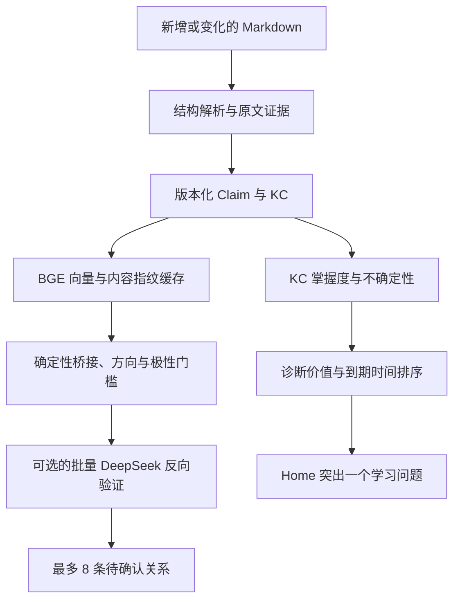

# Liora

<p align="center">
  
</p>

<p align="center">
  <strong>让个人知识不只被保存，而是持续被理解、整理与照料。</strong>
</p>

<p align="center">
  本地优先的桌面学习伙伴 · Obsidian 知识引擎 · 离线语音输入
</p>

> 当前源码版本：桌面端 `0.4.0`，Obsidian 插件 `0.8.0`，知识流水线 `learning-engine-v4`。主要在 Windows 10/11 x64 上开发和验证，仍处于积极迭代阶段。

Liora 把复述、零散想法和已有 Markdown 组织成可维护的个人知识库，并根据真实学习证据安排诊断、回顾与迁移练习。桌面角色是日常入口；Knowledge Engine 才是系统核心。

Liora 追求的是**单位注意力的学习收益**，不是关系数量、知识图谱密度或 AI 活跃度。因此，没有通过证据和逻辑门槛时，显示零条建议就是正确结果。

## 现在可以做什么

| 能力 | 当前实现 |
| --- | --- |
| 反思与知识沉淀 | 用追问帮助用户说清一个概念，生成结构化草稿，编辑确认后再保存 |
| Obsidian 主数据 | 连接 Vault 后以 Markdown 为长期主数据；SQLite 只保存索引、状态、缓存和审核记录 |
| 知识对齐 | 在候选召回后区分 CREATE / UPDATE / CHILD / RELATED，并把冲突证据交给人工审核；创建不会再显示空的“旧内容差异” |
| 安全变更 | 不确定的写入进入 ChangeSet，可查看字段级差异、拒绝、应用和回滚 |
| 高价值关联 | 只显示有双侧原文和连续逻辑路径的关联；当前开放明确引用与严格因果衔接 |
| 学习者状态 | 在知识组件（KC）层记录掌握度、不确定性、稳定性、迁移水平、误区和证据次数 |
| 自适应学习 | 把开放问题、诊断题、迁移检验和到期回顾放入同一队列，默认只突出一个下一步 |
| 知识粒度 | 提供包含子标题、问题、原文分配、步骤、风险和回退说明的拆分预览 |
| 本地语义检索 | 使用 BGE Small INT8 ONNX 做候选召回和知识库问答；Embedding 不直接产生可见关联 |
| 本地语音 | Vosk 负责低延迟唤醒；SenseVoice-Small INT8 负责中英混合听写和语音命令 |
| Obsidian 工作区 | 提供 Liora Home、回顾卡片、知识管理台、关系归档、结构建议和 Vault 范围设置 |

<p align="center">
  
  
</p>

## 设计原则

Liora 对知识操作使用不可互相抵消的顺序门槛：

```text
忠实原文与正确文件操作
> 逻辑有效
> 对当前学习有帮助
> 出现时机合适
> 覆盖率与数量
```

- BGE、关键词和文档相似度只负责召回候选，不能直接生成关系。
- 每条可见关系必须有双侧原文、明确方向、类型化路径、学习收益和失效条件。
- `<!-- liora:* -->`、frontmatter、模板标题和空占位不会进入语义证据。
- 共同主题、共同词汇、共同因果语气或共同“思维风格”不会单独成为启发性关联。
- AI 结果必须能回指输入原文；无法落回原文的 claim 会被丢弃。
- DeepSeek 预算耗尽时宁可延后分析或不显示，也不会用宽松正则补出低质量关系。
- 拆分和合并属于知识维护队列，不会冒充当前最值得学习的下一步。
- 用户选择建立、忽略或重新考虑关联后，待确认卡片会归档并保留当时的证据快照。

## Learning Engine v4



### 1. 证据化知识结构

Markdown 会先按标题与规范字段解析。系统从核心理解、关键要点、推理过程、例子、边界、连接和开放问题中提取 claim，并保存原文、字段、顺序、内容指纹、模型与流水线版本。

知识组件（KC）以一个可独立诊断的问题为中心。KC 状态不会因为“笔记存在”或“用户打开过文件”就被判定为掌握；更新证据来自答题结果、是否独立回忆、提示次数、具体误区、迁移任务和显式评价。

### 2. 严格关系发现

当前可见关系包括：

- `explicit_reference`：用户在正文中明确写出的 Obsidian 链接；
- `causal_continuation`：两篇笔记能组成严格的 `X → M → Z` 连续因果链。

例如，只有当一篇笔记的结论与另一篇笔记的原因在方向、条件、层级和极性上兼容时，才会生成关联。两篇笔记都出现“因为/所以”并不够。

每次刷新最多保留 8 条未决候选，同一来源默认最多一条；DeepSeek 每轮最多批量验证 3 条 finalist。可见卡片会同时给出：

- 两侧原文；
- 中介命题和路径方向；
- 为什么值得阅读；
- 在什么条件下不成立；
- 确认或忽略后的不可变决策记录。

### 3. KC 学习状态与推荐

KC 初始采用轻量三态：`unknown`、`uncertain`、`mastered`，并单独保存置信信息。一次答题会根据结果、是否独立回忆、提示次数、误区和任务类型更新：

- `mastery`：当前掌握估计；
- `uncertainty`：系统对该估计的不确定程度；
- `stability_days` 与 `retrievability`：回顾稳定性；
- `transfer_level`：能否在新场景中使用；
- `misconceptions`：尚未解决的具体误区。

下一问题使用透明的一步价值估计：综合 KC 不确定性、掌握度的熵代理和学习相关性先验，再结合到期时间与跳过记录排序。开始、跳过、稍后再问和答题结果分别记录，内容价值与出现时机不会混成同一种反馈。

### 4. 可执行的拆分建议

笔记长度不是拆分理由。系统只有在至少形成两个可独立学习和检索的问题簇时才建议拆分，并展示：

- 每个子知识的标题、学习目的和诊断问题；
- 分配给它的精确原文片段与字段；
- 父知识继续保留的上下文；
- 创建、链接和层级记录步骤；
- 不应拆分的条件和上下文丢失风险。

当前拆分使用 `copy_then_link`：先创建子知识、建立 Parent / Child 链接并保留原笔记全文。合并采用非破坏性确认，先记录结构决定，把内容安全放在首位。

## 系统组成

| 组件 | 技术 | 职责 |
| --- | --- | --- |
| 桌面端 | Electron | 桌面角色、反思入口、语音控制、天气提醒、启动本地后端 |
| Knowledge Engine | Python HTTP service | 草稿、知识写入、检索、对齐、关系、学习状态和审核 |
| 长期知识 | Obsidian Markdown | 可读、可编辑、可迁移的个人知识主数据 |
| 运行状态 | SQLite WAL | 索引、版本、ChangeSet、向量、KC 状态、路径、决策、Token 使用 |
| 语义召回 | BGE Small INT8 ONNX | 本地懒加载的文档与问题向量；空闲自动释放 |
| 完整听写 | SenseVoice-Small INT8 ONNX | 多语言与中英混合语音转写；不携带 Whisper/PyTorch 回退 |
| 唤醒识别 | Vosk | 常驻、低延迟识别 “Hi Liora” 等唤醒形式 |
| 可选远程推理 | DeepSeek | 知识整理、歧义裁判、原文约束抽取和少量路径反向验证 |
| Obsidian 插件 | TypeScript | Home、问题卡、知识管理台、归档与 Vault 文件打开 |

桌面端与插件通过随机本地端口和临时 Token 通信，只监听 `127.0.0.1`。插件在桌面端未运行时自动退回 Vault 本地只读模式。

## 快速开始

### 路线 A：安装 Windows 版

适合只想使用 Liora 的 Windows 10/11 x64 用户。

1. 从 [GitHub Releases](https://github.com/shuijiacui/Liora/releases/latest) 获取最新安装程序；当前源码构建名为 `Liora-Setup-0.4.0-x64.exe`。
2. 双击安装并选择目录。当前构建未做商业代码签名，SmartScreen 可能显示“未知发布者”。
3. 启动 Liora，在托盘菜单中连接一个 Obsidian Vault。
4. 按下文单独安装 Obsidian 插件；Windows 安装包不会自动写入你的 Vault。

仓库当前本地产物：

```text
release/Liora-Setup-0.4.0-x64.exe
SHA-256: 9520B64316F484E82E47FD4EF1166C9705D6F411665F1C0E59B3E3FCC11716DB
```

可在 PowerShell 中校验：

```powershell
Get-FileHash .\release\Liora-Setup-0.4.0-x64.exe -Algorithm SHA256
```

安装包约 438 MiB，因为它包含 Electron、冻结的 Python Runtime、SenseVoice、Vosk 和 BGE。建议为安装与首次运行预留至少 1.5 GiB 空间。

### 路线 B：从源码运行

适合开发、调试或修改算法。参见[开发环境](#开发环境)。

## 第一次使用

### 1. 连接 Vault

建议先使用专用或已备份的 Vault。打开 Liora 托盘菜单，选择知识库连接功能并选中 Vault 根目录。Liora 会只读扫描 Markdown、建立索引，并把路径保存在用户数据目录。

管理范围可以在 Obsidian 插件中按文件夹配置。默认会排除插件资源、Copilot Agent/skills 等非个人知识目录；更具体的子文件夹规则可以覆盖父级规则。

### 2. 完成一次知识沉淀

1. 点击桌面角色开始反思，输入或说出刚学到的内容。
2. 回答 Liora 的短追问，直到核心概念和未解决问题足够明确。
3. 生成结构化知识草稿。
4. 在确认界面编辑标题、核心理解、要点、推理、例子、边界和开放问题。
5. 确认后才写入知识；放弃则不会创建 Markdown。

连接 Vault 后，新知识默认写入：

```text
00 Inbox/Liora/<知识标题>.md
```

写入会经过路径校验、原子替换、重新扫描和 Vault 相对路径回传。更新 Liora 管理的块时，块外的手写内容会被保留。

### 3. 安装 Obsidian 插件

插件当前采用本地构建安装：

```powershell
cd obsidian-plugin
npm.cmd install
npm.cmd run check
```

创建插件目录：

```text
<Vault>/.obsidian/plugins/liora-knowledge/
├── main.js
├── manifest.json
├── styles.css
└── assets/
    ├── home-banner.png
    └── manager-banner.png
```

PowerShell 复制示例：

```powershell
$LioraVault = "D:\你的Vault"
$LioraPluginDir = Join-Path $LioraVault ".obsidian\plugins\liora-knowledge"
New-Item -ItemType Directory -Force $LioraPluginDir | Out-Null
New-Item -ItemType Directory -Force (Join-Path $LioraPluginDir "assets") | Out-Null

Copy-Item "obsidian-plugin\main.js","obsidian-plugin\manifest.json","obsidian-plugin\styles.css" -Destination $LioraPluginDir -Force
Copy-Item "obsidian-plugin\assets\home-banner.png","obsidian-plugin\assets\manager-banner.png" -Destination (Join-Path $LioraPluginDir "assets") -Force
```

然后在 Obsidian 的“设置 → 第三方插件”中启用 `Liora Knowledge`。更新插件后需要重新加载插件或重启 Obsidian。

## 开发环境

### 要求

- Windows 10/11 x64（主要验证平台）；
- Node.js 22 或更新的 LTS 版本；
- Python 3.10（当前打包基线；源码运行也可使用兼容的 3.11 环境）；
- 麦克风仅在使用语音时需要；
- Obsidian 仅在使用知识库集成时需要。

### 1. 安装依赖

```powershell
git clone https://github.com/shuijiacui/Liora.git
cd Liora
npm.cmd install

python -m venv .venv
.\.venv\Scripts\python.exe -m pip install --upgrade pip
.\.venv\Scripts\python.exe -m pip install -r backend\requirements.txt
$env:LIORA_PYTHON = (Resolve-Path .\.venv\Scripts\python.exe).Path
```

也可以使用 Conda；只要把 `LIORA_PYTHON` 指向安装了 `backend/requirements.txt` 的解释器即可。

### 2. 下载本地模型

模型不会在应用运行时隐式下载：

```powershell
& $env:LIORA_PYTHON scripts\setup-wake-models.py
& $env:LIORA_PYTHON scripts\setup-voice-model.py
& $env:LIORA_PYTHON scripts\setup-embedding-model.py
```

模型保存在 `.models/`，已加入 Git 忽略。下载脚本会校验必要文件；SenseVoice 模型源需要 Git LFS 可用。

### 3. 配置可选服务

```powershell
Copy-Item .env.example .env
```

不配置 API Key 也能运行：语音、Vault、BGE、严格本地关系、学习状态和大部分管理功能仍然可用。DeepSeek 用于质量更高的知识整理、歧义裁判和少量结构化验证；Tavily 只用于明确的联网查证。

### 4. 启动

```powershell
npm.cmd start
```

其他运行方式：

```powershell
npm.cmd run dev
npm.cmd run start:desktop
npm.cmd run start:device
npm.cmd run dev:device
```

设备模式仍是实验性 800×480 界面，详情见 [docs/device-mode.md](docs/device-mode.md)。

## 配置

源码模式读取仓库根目录 `.env`；安装版读取 `%APPDATA%\liora-desktop-companion\.env`。已有系统环境变量优先，不会被文件覆盖。修改后需要完全退出并重新启动 Liora。

### DeepSeek 与联网查证

| 变量 | 默认值 | 说明 |
| --- | --- | --- |
| `DEEPSEEK_API_KEY` | 空 | 为空时使用本地策略 |
| `DEEPSEEK_BASE_URL` | `https://api.deepseek.com` | OpenAI 兼容接口根地址 |
| `DEEPSEEK_MODEL` | `deepseek-v4-flash` | 仓库当前默认模型名，可按服务端实际支持修改 |
| `DEEPSEEK_TIMEOUT_SECONDS` | `30` | 请求超时秒数 |
| `TAVILY_API_KEY` | 空 | 为空时禁用联网查证 |
| `TAVILY_BASE_URL` | `https://api.tavily.com` | Tavily API 根地址 |
| `TAVILY_TIMEOUT_SECONDS` | `15` | 查询超时，限制在 5～60 秒 |
| `TAVILY_MAX_RESULTS` | `4` | 单次最多结果数，限制在 1～8 |

### 学习引擎与本地语义

| 变量 | 默认值 | 说明 |
| --- | --- | --- |
| `LIORA_ALIGNMENT_JUDGE` | `balanced` | `balanced` 只裁判歧义区；`local/off` 不调用 DeepSeek |
| `LIORA_ALIGNMENT_DAILY_LIMIT` | `20` | 每日新对齐裁判缓存上限 |
| `LIORA_AI_DAILY_INPUT_TOKENS` | `60000` | 学习引擎每日 DeepSeek 输入 Token 硬上限 |
| `LIORA_AI_DAILY_OUTPUT_TOKENS` | `15000` | 学习引擎每日 DeepSeek 输出 Token 硬上限 |
| `LIORA_EMBEDDING_MODEL_ID` | `onnx-community/bge-small-zh-v1.5-ONNX` | 本地语义模型标识 |
| `LIORA_EMBEDDING_MODEL_DIR` | 自动定位 | 自定义 BGE 模型目录 |
| `LIORA_EMBEDDING_MAX_LENGTH` | `512` | 单条输入最大 Token 长度 |
| `LIORA_EMBEDDING_BATCH_SIZE` | `8` | 批处理大小，限制在 1～32 |
| `LIORA_EMBEDDING_IDLE_SECONDS` | `300` | BGE 空闲释放时间，限制在 30～3600 秒 |

### 语音、运行模式与天气

| 变量 | 默认值 | 说明 |
| --- | --- | --- |
| `LIORA_VOICE_THREADS` | 自动 2～4 | SenseVoice CPU 线程数，限制在 1～8 |
| `LIORA_VOICE_IDLE_SECONDS` | `180` | SenseVoice 空闲释放时间，限制在 30～3600 秒 |
| `LIORA_PYTHON` | 自动探测 | 源码运行和打包使用的 Python 绝对路径 |
| `LIORA_USER_DATA_DIR` | Electron 默认目录 | 高级选项：覆盖用户数据目录，必须是绝对路径 |
| `LIORA_RUNTIME` | 空 | 设为 `device` 时选择实验性设备模式 |
| `LIORA_DEVICE_WINDOWED` | `0` | 设备模式开发时使用普通窗口 |
| `LIORA_WEATHER_ENABLED` | `1` | 经纬度存在时启用；设为 `0` 禁用 |
| `LIORA_WEATHER_LOCATION` | 空 | 天气地点显示名 |
| `LIORA_WEATHER_LATITUDE` | 空 | 纬度 |
| `LIORA_WEATHER_LONGITUDE` | 空 | 经度 |

## 性能、内存与网络

### 本地模型磁盘占用

当前仓库模型文件的近似大小：

| 模型 | 用途 | 大小 |
| --- | --- | ---: |
| SenseVoice-Small INT8 | 完整听写 | 约 230 MiB |
| Vosk 中英模型 | 唤醒词 | 约 133 MiB |
| BGE Small INT8 | 语义召回 | 约 23 MiB |

这些是磁盘大小，不等于运行内存。实际峰值取决于 ONNX Runtime、输入长度、线程数和系统分配器，因此 README 不承诺一个未经测量的固定 RAM 数字。

- SenseVoice 和 BGE 都按需懒加载；默认分别空闲 180 秒和 300 秒后释放会话。
- 已计算的向量、claim、路径和学习状态保存在 SQLite；释放模型不会丢失这些缓存。
- DeepSeek 是远程计算，不会把远程模型权重加载进本机内存。
- 关系分析只处理变化笔记和局部候选，以轻量流水线控制常驻内存与全库扫描成本。

### 网络边界

| 功能 | 是否联网 |
| --- | --- |
| SenseVoice、Vosk、BGE、Vault 扫描与 SQLite | 否 |
| DeepSeek 整理与验证 | 仅配置 Key 后 |
| Tavily 查证 | 仅配置 Key 且需要查证时 |
| 天气 | 仅配置位置并启用后，访问 Open-Meteo；自动地名解析会访问 Nominatim |

## 测试与构建

### 测试

```powershell
npm.cmd test
& $env:LIORA_PYTHON -m unittest discover -s backend\tests -p "test_*.py"

cd obsidian-plugin
npm.cmd run check
```

`0.4.0 / 0.8.0` 当前本地基线：

- Electron / Node.js：44 项通过；
- Python 后端：89 项通过；
- Obsidian 插件：26 项通过；
- 安装包内冻结后端已完成 `/health` 黑盒冒烟测试。

测试覆盖语音状态机、唤醒协调、Vault 安全写入、迁移、空差异创建、格式噪声、严格因果路径、关系归档、KC 更新、插件问题卡和路径解析。

### Windows 打包

首次准备精简打包环境：

```powershell
npm.cmd run setup:packaging
```

Python、后端依赖或模型发生变化时必须完整构建：

```powershell
npm.cmd run dist:win
```

只有 Electron 页面、样式或普通 JavaScript 变化时才可复用旧 Python Runtime：

```powershell
npm.cmd run dist:win:fast
```

目录版使用 `pack:win` / `pack:win:fast`。输出位于 `release/`。更多说明见 [docs/packaging.md](docs/packaging.md)。

## 数据与隐私

安装版用户数据位于：

```text
%APPDATA%/liora-desktop-companion/
├── liora.sqlite3
├── knowledge-settings.json
├── knowledge-scope.json
├── reminder-settings.json
├── voice-settings.json
├── weather-settings.json
├── backups/
└── .env
```

- 覆盖安装和普通卸载默认不删除用户数据；
- `.env` 不进入安装包，也不应提交到 Git；
- 连接 Vault 后，确认的 Markdown 是长期主数据；
- 原始反思对话在知识确认后清理，只保留必要的结构化事件和学习状态；
- 关系决定保留证据快照，以便审计、归档和重新考虑；
- Liora 默认不监控浏览器、键盘或其他桌面应用。

在让 Liora 管理重要 Vault 前，仍建议使用 Git、Obsidian Sync 或其他方式备份。

## 为什么适合个人知识库

- **精度优先**：相似度只召回候选，严格路径门槛负责决定是否值得展示，减少无效阅读。
- **逐步理解用户**：KC 状态由回忆、提示、误区和迁移结果持续更新，而不是根据笔记数量猜测掌握程度。
- **低打扰**：学习队列默认只突出一个下一步；跳过、稍后再问和答题反馈分别影响后续推荐。
- **可解释**：知识变更有字段差异，关系有双侧证据和失效条件，拆分有原文分配和执行步骤。
- **非破坏性**：高风险操作先审核、可归档、可回滚；拆分保留父知识，合并先记录决定。
- **本地优先**：语音、Embedding、Vault 和学习状态都可在本机运行，远程模型是可选增强。
- **成本可控**：只分析变化内容，使用内容指纹缓存、每日 Token 硬预算与模型空闲释放。

## 常见问题

### 安装版升级后仍像旧版本

Windows 安装包包含冻结的 Python Runtime。修改 `backend/` 后仅重启旧安装版不会生效，必须运行 `npm.cmd run dist:win` 重新构建并覆盖安装。Obsidian 插件是独立产物，也需要重新构建、复制并加载。

### Obsidian 插件显示离线或 `VAULT ONLY`

先确认 Liora 桌面端正在运行。插件会自动发现本机临时连接；连接失败时仍可显示 Vault 本地只读内容，但调度、归档和写入动作需要 Knowledge Engine。

### 整理后在 Obsidian 看不到文件

检查：

1. Liora 连接的 Vault 是否就是当前 Obsidian 打开的 Vault；
2. 待确认 ChangeSet 是否已经应用；
3. `00 Inbox/Liora/` 是否被插件范围规则排除；
4. 管理台返回的 Vault 相对路径能否通过 Obsidian API 打开；
5. `%APPDATA%\liora-desktop-companion\backups\` 和后端日志是否记录写入失败。

Liora 不应在文件未落盘或重新扫描失败时报告成功。

### 新关联为什么很少，甚至为零

这是预期行为。相似笔记不会自动成为关联；候选必须通过原文、方向、条件和学习收益门槛。零结果优于占用阅读时间的宽松推荐。

### SenseVoice 或 BGE 显示不可用

源码模式确认 `.models/sensevoice/` 与 `.models/embeddings/bge-small-zh-v1.5/` 已准备，并检查当前 Python 是否安装 `onnxruntime`、`tokenizers` 和 `kaldi-native-fbank`。应用不会在运行时偷偷下载模型。

### PowerShell 不允许运行 `npm.ps1`

使用 `npm.cmd`，或在当前进程设置合适的执行策略；不要为了运行项目永久放宽整台机器的安全策略。

## 项目结构

```text
Liora/
├── assets/                     桌面角色资源
├── backend/                    Python Knowledge Engine、语音与测试
│   ├── learning_intelligence.py  Claim/KC、严格关系和学习状态
│   ├── knowledge_intelligence.py 对齐、检索、差异和粒度候选
│   ├── knowledge_store.py       Obsidian Markdown 解析与安全写入
│   ├── database.py              SQLite schema、迁移和运行状态
│   ├── semantic_embedding.py    BGE ONNX 懒加载与空闲释放
│   ├── sensevoice_runtime.py    SenseVoice ONNX 推理
│   └── tests/
├── docs/                       打包与设备模式文档
├── obsidian-plugin/            Obsidian 插件源码、资源和测试
├── packaging/                  PyInstaller / Electron Builder 配置
├── scripts/                    启动、模型准备和构建脚本
├── src/                        Electron 主进程、渲染层与共享服务
├── tests/                      Electron / Node.js 测试
├── .env.example               配置模板
└── package.json
```

进一步阅读：

- [Windows 打包说明](docs/packaging.md)
- [设备模式说明](docs/device-mode.md)
- [Obsidian 插件开发说明](obsidian-plugin/README.md)
- [知识引擎设计记录](Obsidian_Plugin_Knowledge_Engine_Design.md)

## 参与开发

提交改动前至少完成与改动范围对应的测试。知识算法变更还应加入困难负例，例如：格式标记相同、因果方向相反、桥接前提缺失、时间尺度不兼容、只有主题相似、明显但无学习收益的关系，以及不应拆分的强依赖段落。

请勿提交：

- `.env`、API Key 或用户数据；
- `.models/` 中的本地模型；
- Vault 原文、SQLite 数据库和备份；
- 与当前实现无关的大型生成物或临时实验数据。

## 许可证

参见 [LICENSE](LICENSE)。第三方模型和依赖仍适用各自许可证；分发安装包前请单独核对模型权重、运行库和数据源的许可要求。
